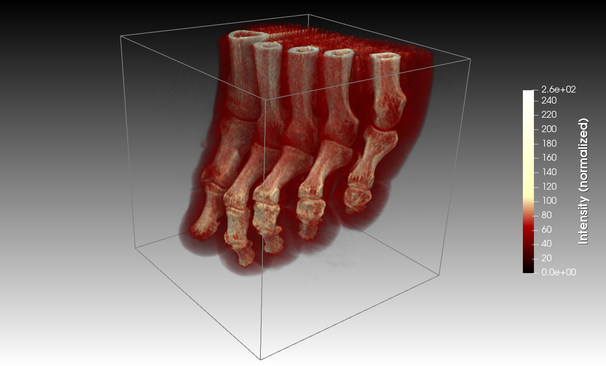
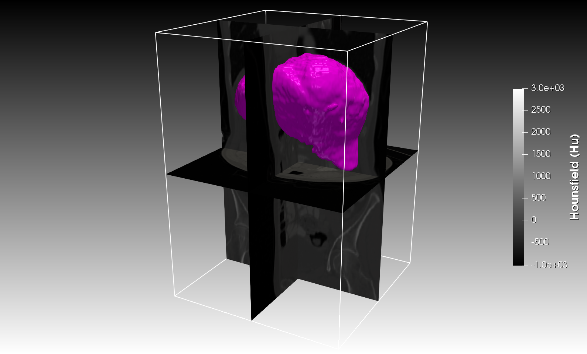
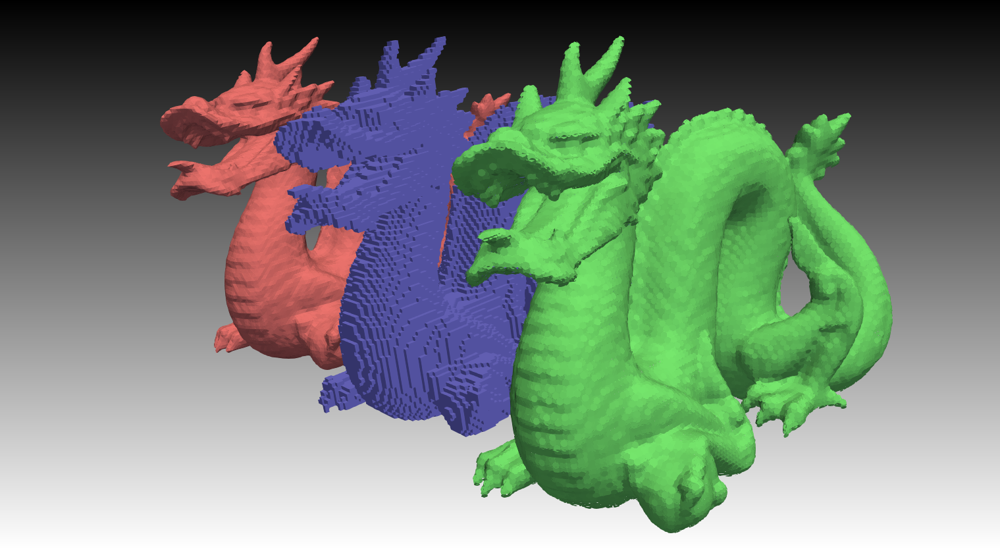

# Assignment 2 - Volume visualization

In this exercise you will investigate the volume rendering capabilities of Paraview, and also look at different ways that isosurfaces can be represented.

Requirements to pass: Before the deadline, present Part 1 to one of the lab assistants and hand in ParaView state files of working solutions for Parts 2 and 3. See the main course page for more details.

## Obtaining the source code and datasets

Download (or clone) the Git-repository of this assignment.

## Part 1 - Direct volume rendering of CT and MRI data

In this part you will perform direct volume rendering of either CT (foot.vtk) or MRI (brain.vtk) data. The aim is to create a visualization displaying different features in each volume with help of transparency and distinct colors. For the CT scan these features could be, for example, skin, bone, and fat. For the MRI scan it could be peaks in the image histogram. To solve this task, you need to create a custom transfer function (colormap in ParaView) for each dataset and fine-tune the color and opacity control points.

### Tasks

For one of the datasets (CT or MRI):

- Load the dataset into ParaView and activate the direct volume rendering mode by selecting Volume under Representation.
- Design a custom transfer function for the dataset. For the CT data, the function should highlight features such as skin, fat, and bone of different densities (similar to in the screenshot above, but not necessarily in the same colors). For the MRI data, you can use either the Data Histogram in the Color Map Editor or the Histogram filter to find peaks in the data to highlight.
- Enable shading of the volume by selecting Shade under Volume Rendering properties (skip this step for the MRI data).
- Add an outline showing the extent of the volume.

 
## Part 2 - Visualization of segmented CT data with MPR

Your task is to create a visualization showing slices of a medical CT-scan of the abdomen combined with an isosurface of the liver segmented from the data. This type of visualisation could for example be used by a physician to verify that the segmentation mask, which might have been generated with an automatic segmentation algorithm, is correct. The CT scan, ctscan_ez.vtk, is stored as a vtkStructuredPoints dataset of signed 16-bit data (short) representing Hounsfield units. The segmented liver is represented as a binary 8-bit (unsigned char) volume, ctscan_ez_bin.vtk, where the liver voxels have the value 255 and the background voxels have the value 0.

Applying the contour filter directly to the binary liver segmentation will result in an isosurface that shows a lot of aliasing. You should therefore also compare this isosurface with the isosurface of a pre-filtered, Gaussian smoothed version of the segmentation (ctscan_ez_smooth.vtk). To generate the smoothed version, run the included Python script gaussian_smooth.py from ParaView's Python shell or the pvpython command line tool.

### Tasks

- Add a multi-planar reformatting (MPR) visualisation of the CT volume (using the Slice filter). The MPR should contain one slice plane per image axis.
- Add a colormap (with a colorbar) that maps the 16-bit CT Hounsfield values to grayscales.
- Add an isosurface rendering of the binary liver segmentation volume (using the Contour filter).
- Compare the previous isosurface with the isosurface extracted from the Gaussian smoothed version of the segmentation (it is sufficient if only one of the isosurfaces is visible in the solution that you hand in).
- Add an outline showing the extent of the volume.

## Part 3 - Triangles, voxels, and surfels

In this part, you will compare three different surface representations extracted from the same volume dataset (dragon.vtk). The first is triangles extracted with Marching cubes (using the Contour filter in ParaView); The second is surface voxels extracted from all foreground voxels having at least one background voxel as 6-connected neighbor. The third is a point-based representation (surfels) extracted from the same grid cells examined in the Marching cubes algorithm. Since ParaView only supports extracting the first representation, you need to use the supplied scripts (extract_voxels.py and extract_surfels.py) to generate the other two.

### Tasks

- Extract an isosurface (using the Contour filter) from the volume dataset. Also change the Lighting->Interpolation property to Flat so that the triangles become visible.
- Load the other two representations (voxels.vtk and surfels.vtk) and expand their points into either small cubes or oriented disks (using the Glyph filter). To create oriented disks, Glyph Type should be set to 2D Glyph and Circle, and the orientation given by the gradient vectors in the data (an additional 90 degrees rotation around the Y-axis in the Glyph Transform is also needed to orient the disks correctly). 
- Assign a different transformation and color to each representation to make the easier to compare.